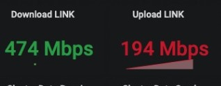
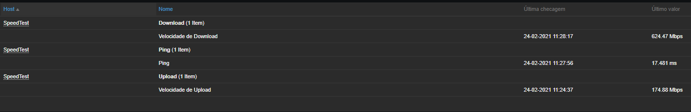

# Monitoramento de Velocidade via Zabbix

# NUNCA UTILIZE ESSAS MÉTRICAS EM UM CURTO ESPAÇO DE TEMPO (COLETA). ISSO IRÁ ONERAR BASTANTE TEU LINK DE INTERNET. 

Já pensou em saber qual é a velocidade que é entregue por sua operadora naquele momento? Irei ensinar a como realizar esse monitoramento via Zabbix.

Antes de começar é necessário que seja colocado os dois scripts em  externalscripts do Zabbix (ou aonde você definiu) e timeout 30.

## Como fazer:

* crontab -e colocar */20 * * * * /usr/lib/zabbix/externalscripts/speedtest.py --simple  > /tmp/velocidade.txt
* cd /usr/lib/zabbix/externalscripts/
* wget https://github.com/sivel/speedtest-cli/raw/refs/heads/master/speedtest.py
* wget https://raw.githubusercontent.com/everaldoscabral/velocidade-speedtest/main/velocidade.sh
* chmod 777 velocidade.sh speedtest.py

Agora basta importar o template *TEMPLATE-SPEEDTEST.xml.* E criar o host e associar o template importado.

O script speedtest.py será executado a cada 20 minutos e os itens são coletados a cada 25 minutos.

## Imagens:

